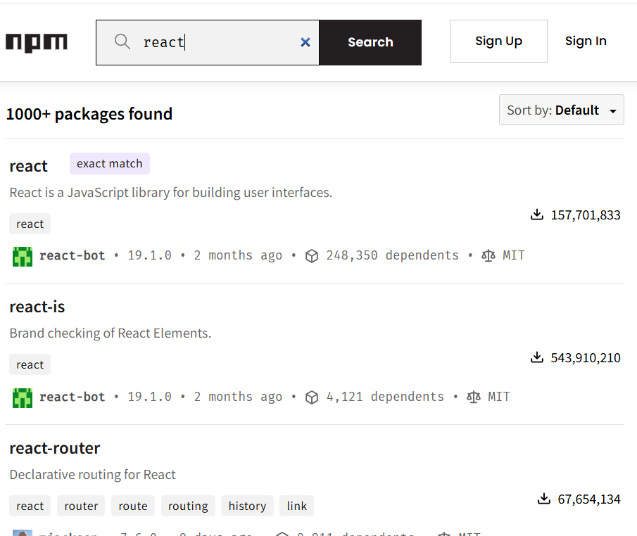
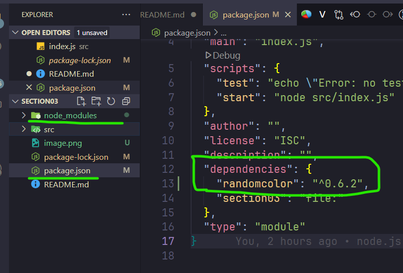
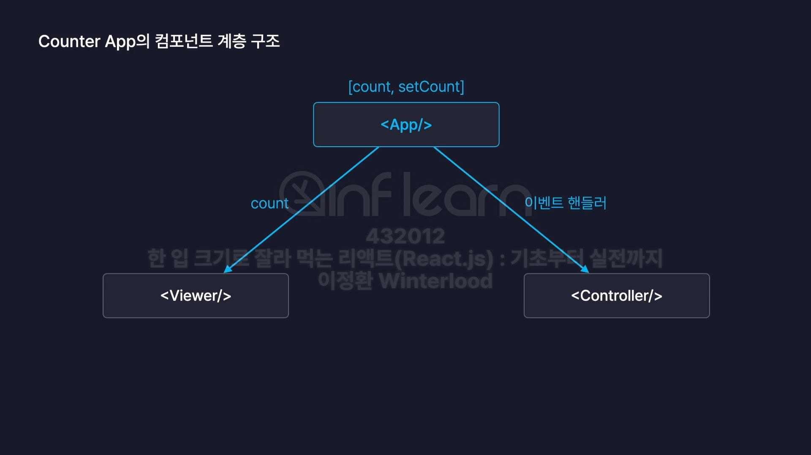
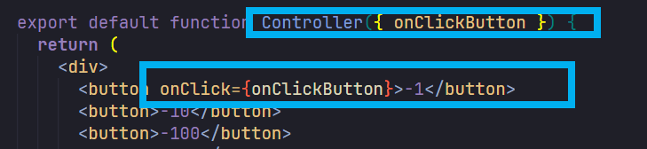
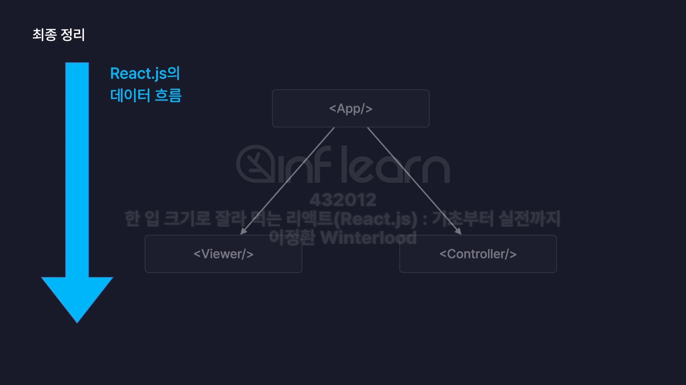
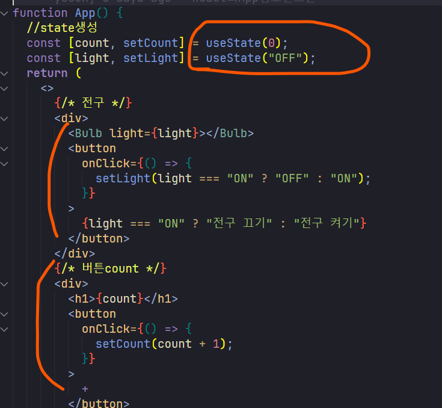

# React 실습 ( 2025.05.16)

## EsLint 설정

- rules배열 끝나는 지점에 옵션 추가하기
-       "no-unused-vars":"off",
      "react/prop-types":"off"

## React App 컴포넌트

- App.jsx 파일에서 App함수
- 자바스크립틔 App함수는 `<html>`코드를 반환하도록 설정할 수 있음
- 이런 `<html>`코드를 반환하는 함수들을 👉 컴포넌트 라고 부름
- 보통 컴포넌트 이름 부를때, 자바스크립트 함수 이름을 따옴

### App컴포넌트의 자식 컴포넌트

- React는 랜더링시 App.jsx를 root로 하여 뿌리로 , 즉 부모 컴포넌트이기 때문에
- 우리가 다른 컴포넌트를 생성하여 화면에 랜더링을 하려면 부모 컴포넌트 안에 종속되어야 한다.
- 즉) `부모`컴포넌트인 App컴포넌트 하위에 `자식`컴포넌트로 위치 해야한다는 점이다.

### 📢main.jsx에서 App컴포넌트 이외에 다른 컴포넌트 추가 못할까?

- main컴포넌트를 확인해보면
  `createRoot(document.getElementById('root')).render(
    <App />
) `
- 이런식으로 App컴포넌트가 호출되게 되는데, App컴포넌트 이외에 다른 컴포넌트 , 예를들어 아래 예시코드 처럼 `Header` 컴포넌트도 추가해도 될까?? 궁금해졌다.
- `createRoot(document.getElementById('root')).render(
    <App />
    <Header/>
) `

#### 답변: NO!

- React에서 `createRoot().render()`는 단일 루트 요소만 렌더링할 수 있다.
- 즉, `render()` 메서드는 하나의 JSX 요소만 받아서 `id="root"`에 렌더링함.

#### why 단일 루트 요소만 랜더링 가능?

- 단일 루트 요소가 있어야 `DOM 트리` 와의 매핑이 명확해짐
- 여러 요소를 랜더링 하고싶으면 👉 하나의 부모 요소로 감싸야 React가 이를 하나의 트리로 처리할 수 있음.

#### 결론 : React는 계층구조를 가져야 한다.

- 최상위 컴포넌트 `App`컴포넌트의 하위컴포넌트로 랜더링 하자.
- React의 컴포넌트 계층 구조를 유지하며, App이 모든 UI를 관리하는 중심 역할을 해야한다.
- 코드가 깔끔하고, 다른 컴포넌트를 추가하거나 관리하기 쉬움.

---

# JSX로 UI표현하기

- JSX ( JavaScript Extensions ) 는 자바스크립트의 확장된 문법
- JavaScript와 HTML코드를 혼용하여, 사용가능
  
- 이미지 처럼, 자바스크립트로 변수 설정 👉🏻 HTML코드에서 `{}`중괄호 사용하여 구성 요소 작성 가능

## JSX 문법 특징

- 동적으로 특정 변수의 값 👉🏻 HTML랜더링 설정 할 수 있음.

## JSX 주의 사항

1. 중괄호 내부에는 JS표현식만 사용 가능.

- 삼항연산자
- 값 그대로
- 변수명
- 📣조건문,반복문은 불가함.

2. 숫자,문자열,배열 값만 랜더링 된다.

- boolean,null,undefined 랜더링 안된다.

3. 객체 그대로는 랜더링 할 수 없음

- `const obj = {a:1}` 을 사용하려면 점 표기법 사용해야함
- `{obj}` 객체 그대로 사용하면 랜더링 안됨
- `{obj.a}`로 점표기법 사용해야 함 !

4. 최상위 태그는 반드시 하나여야 한다.

- `return` 안에는 최상위 태그 1개만 있어야함.
- 최상위태그는 `빈태그 <></>`도 가능하다.

## JSX 스타일 설정(2가지)

### 1. 요소에 직접 스타일 설정

- 객체를 전달해야함
- {{}}중괄호 두개 써야함
- `
로그아웃2
`
- But, 가독성 떨어짐 ㅋ 비추 !

### 2. 별도의 css파일 만들기

- 동일한 "components"폴더 안에 css파일 만들기
- Main.jsx에 `import "./Main.css"` 설정
- ` 
로그아웃2
` css스타일 설정하기
   

---

 

# 이벤트 처리하기

- 이벤트 : 웹페이지 내부에서 발생하는 사용자의 모든 행동
  - ex)버튼 클릭, 메세지 입력, 스크롤 등등
- 핸들링 : 다루다, 취급하다, 처리하다
   

## 이벤트 핸들링 이란?

- 웹에서 이벤트가 발생했을때, 그것을 처리하는 것
  - ex) 버튼 클릭시 -> 경고장 노출
     

### 이벤트 핸들러

`const onClickButton = () => {
    console.log(text)
  }`

- 이벤트가 발생했을 때 , 실행되는 함수 (화살표함수) => 실질적으로 처리하는 함수이기 때문에 이벤트 핸들러 라고 부른다
- 즉, 화살표 함수가 " 이벤트 핸들러 " 이다.
   

## 이벤트 객체

- 리액트에서 발생되는 모든 이벤트들 ( 클릭, 마우스엔터) 이벤트 핸들러 함수를 호출하면서 , 이벤트 핸들러 함수의 매개변수로 👉🏻 이벤트 객체를 제공함
  ` const onClickButton = (e) => {
  console.log(e)
  console.log(text)
}`
- 이렇게 이벤트 핸들러에 매개변수 e를 넣었을 때, 개발자 도구로 확인해보면, 합성이벤트(Synthetic Base Event)를 확인 할 수 있다.

 

- ### 합성이벤트(Synthetic Base Event) 객체란?
- 브라우저별로 이벤트 객체가 다 다르다.
- 이걸 하나로 통일해주는 것이 합성이벤트(Synthetic Base Event)이다.
- 여러 브라우저의 규격을 참고하여 1개의 이벤트 객체로 포맷팅 해줌.
- 🪂합성이벤트 객체는 발생한 모든 이벤트들의 정보가 들어있음.

 

---

 

# State 상태

- 상태를 의미함
- 각 컴포넌트에서 생성된 `state()` 환경에 따라 UI가 달라짐
- 리액트가 `state()`를 상태 변화될 때 , 자동으로 감지하여 UI변화시킴.
- 이때, 달라지는 UI를 `리랜더링(Re-Rendering) ` 이라고 합니다.

 

## useState

`  const state = useState();
  console.log(state);`

- 리액트가 제공하는 상태함수인 `useState()`를 호출하게 되면, 두 개의 요소를 담은 `배열`을 반환 함.

 
 

### useState 첫 번째, 배열 요소(state상태값)

첫번째 배열요소는 **새롭게 생성되는 state의 값**

- 새로운 state를 생성하고, 초기값을 "0" 이라고 설정하게 되면?
- 첫번째 배열값이 0이 된걸 확인 할 수 있다.

   
 

### useState 두 번째, 배열 요소(상태변화함수)

두번째 배열요소는 **state의 상태를 변화시키는 함수 = 상태 변화 함수 **
`const [state, setState] = useState(0);`

- state = 현재 useState를 통해 생성한 " 값 " 이 들어있음.
- setState = state의 값을 변경 시키는 " 함수 " 가 들어옴.

## useState 의 리랜더링

` <button
        onClick={() => {
          setState(state + 1);
        }}
      >
        +
      </button>`

1. 버튼 클릭시 state가 변화 👉🏻 리랜더링
2. 즉, App.jsx컴포넌트 함수를 다시 호출하고 👉🏻 새로운 값을 다시 화면에 랜더링 함.

- BUT) 🤔이렇게 하면 , 변화가 1개라도 있을때마다 App컴포넌트를 처음부터 끝까지 다시 리랜더링 할텐데 ,,,,,,,,
  지금은 코드가 적지만, 많은 코드들이 있으면 시간도 오래걸릴 것 같고 "비효율적" 일 것 같다는 생각이 든다.

# useState 는 왜 써야할까?

- **자바스크립트 변수** 를 만들어서 삼항연산자로 갖다 쓰면 되지않을까?
- NOPE! ❌
- 리액트 컴포넌트는 **일반적인 변수**가 아니라, `state` 값이 변해야지만 **리랜더링** 이 된다.

## 결론 🎯state가 변경되어야지만만 "리랜더링"이 된다는 점 !

 
 

---

# State와 props

- 이미지 처럼, 전구의 상태를 부모컴포넌트로부터 props를 전달받아서 사용
- 즉, 부모컴포넌트에서 전구의 상태(state)를 관리하여 자식 컴포넌트로 보냄
- 자식 컴포넌트는 상태(sate)값에 따라 UI랜더링 되도록 따로 관리 함.

 

# 리액트의 리랜더링 발생 상황

1.  자신이 관리하는 state값이 변경될 때
2.  자신이 제공받는 props값이 변경될 때
3.  부모컴포넌트가 리랜더링 되면, 자식 컴포넌트도 리랜더링

- 이미지 처럼 , 관련 없는 state들이 하나의 컴포넌트에 뭉쳐 있으면 " 불필요한 랜더링 " 이 발생
- 🛠️그래서 따로따로 컴포넌트 관리해주는게 좋다.

 
 

---

# State로 사용자 입력 관리

## 생년월일 정보 받기

`const today = new Date().toISOString().split("T")[0]; 
  const [birth, setBirth] = useState(today);
  `

- 오늘 날짜를 기본값(useState())값으로 설정하려면 먼저, today변수부터 설정 해야한다.
- `Date().toISOString()` 결과값은 `2025-05-19T12:34:56.789Z ` 같은 형태로 저장이 된다.
- `split`함수를 사용해서 끊어치기 해야한다.
- 주로 `input type="date"` 과 함께 자주 사용된다.

 
 

---

 
 

# useRef 란?

- 참고하는 객체 타임
- `  // *useRef 레퍼런스 객체 만들기 
const refObj = useRef(1);
console.log(refObj)`
- 초기값을 "1" 로 설정하면 👉🏻 `current:1` current값이 1 이라는걸 확인 할 수 있다.

 
 

## Reference 객체란 "current"프로퍼티에 값을 보관함.

- 단순한 자바스크립트 객체임 -` console.log(refObj.current)` 점 표기법으로 해당 프로퍼티(current)값에 직접 접근 할 수 있다!

- 🚩useRef는 값이 변경되었다고 해서 컴포넌트를 리랜더링 시키지 않음

 
 

## Reference객체는 DOM요소 직접 조작 가능하다.

1. 특정요소에 `포커싱`을 주고싶으면, 그 요소에 우리가` 접근` 해야한다.
2. 새로운 useRef()객체 만들고 👉🏻 ` ref={inputRef}` 태그에서 속성을 추가 해준다.
3. 그리고 제출할때, 문자열이 비어있으면? 포커싱을 주고 싶을때

- ` //\*제출하는 이벤트
const onSubmit = () => {
if (input.name === "") {
//이름을 입력하는 DOM요소에 포커싱함.
inputRef.current.focus()
}
}`
- 이런식으로 `onSubmit` 이벤트 핸들러 함수를 만들어서, `current`에 직접 `focus()`함수를 사용하면 된다.

 
 

## 어차피 랜더링도 안되는데, useRef()써야할까?

- 자바스크립트로 그냥 `let count = 0 ; `으로 초기화 해서 `onChange`가 일어날때마다, `count++;`하면 되는거 아니야 ?????
- ❌실제로 확인해보면, `onChange` 자체가 값이 변할때마다 전체적으로 컴포넌트를 리랜더링 함 👉🏻 그 말은 즉슨, `let count`값도 다시 0으로 초기화 된다는 말임
- 그래서 사용자가 값을 입력해서 컴포넌트가 리랜더링 될때마다, `count`값을 계속 초기화 +1 이거 무한 반복임.

 
 

> useRef(),useState() 같은 리액트의 특수한 변수들은 컴포넌트가 리랜더링 된다고 해서 리셋이 되지 않는다!

- 애초에 내부적으로 이런식으로 설계되어 있음.
