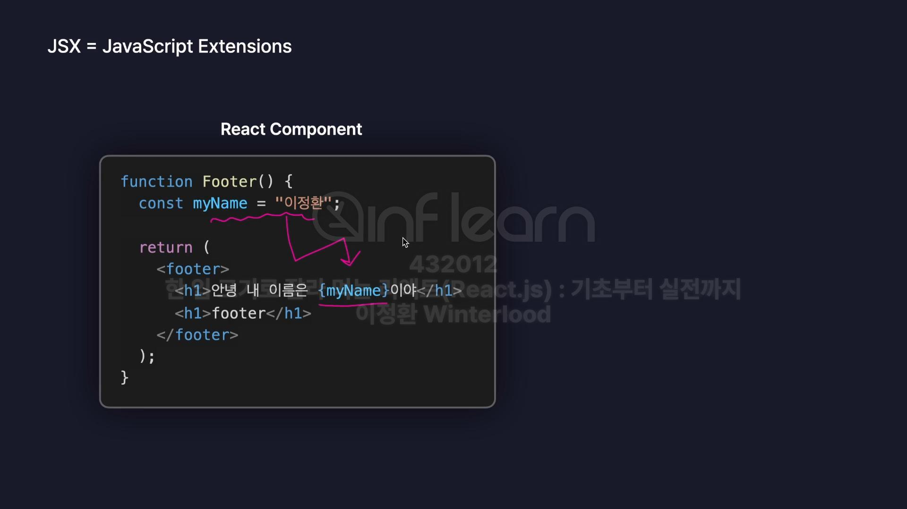

# React 실습 ( 2025.05.16)

## EsLint 설정

- rules배열 끝나는 지점에 옵션 추가하기
-       "no-unused-vars":"off",
      "react/prop-types":"off"

## React App 컴포넌트

- App.jsx 파일에서 App함수
- 자바스크립틔 App함수는 `<html>`코드를 반환하도록 설정할 수 있음
- 이런 `<html>`코드를 반환하는 함수들을 👉 컴포넌트 라고 부름
- 보통 컴포넌트 이름 부를때, 자바스크립트 함수 이름을 따옴

### App컴포넌트의 자식 컴포넌트

- React는 랜더링시 App.jsx를 root로 하여 뿌리로 , 즉 부모 컴포넌트이기 때문에
- 우리가 다른 컴포넌트를 생성하여 화면에 랜더링을 하려면 부모 컴포넌트 안에 종속되어야 한다.
- 즉) `부모`컴포넌트인 App컴포넌트 하위에 `자식`컴포넌트로 위치 해야한다는 점이다.

### 📢main.jsx에서 App컴포넌트 이외에 다른 컴포넌트 추가 못할까?

- main컴포넌트를 확인해보면
  `createRoot(document.getElementById('root')).render(
    <App />
) `
- 이런식으로 App컴포넌트가 호출되게 되는데, App컴포넌트 이외에 다른 컴포넌트 , 예를들어 아래 예시코드 처럼 `Header` 컴포넌트도 추가해도 될까?? 궁금해졌다.
- `createRoot(document.getElementById('root')).render(
    <App />
    <Header/>
) `

#### 답변: NO!

- React에서 `createRoot().render()`는 단일 루트 요소만 렌더링할 수 있다.
- 즉, `render()` 메서드는 하나의 JSX 요소만 받아서 `id="root"`에 렌더링함.

#### why 단일 루트 요소만 랜더링 가능?

- 단일 루트 요소가 있어야 `DOM 트리` 와의 매핑이 명확해짐
- 여러 요소를 랜더링 하고싶으면 👉 하나의 부모 요소로 감싸야 React가 이를 하나의 트리로 처리할 수 있음.

#### 결론 : React는 계층구조를 가져야 한다.

- 최상위 컴포넌트 `App`컴포넌트의 하위컴포넌트로 랜더링 하자.
- React의 컴포넌트 계층 구조를 유지하며, App이 모든 UI를 관리하는 중심 역할을 해야한다.
- 코드가 깔끔하고, 다른 컴포넌트를 추가하거나 관리하기 쉬움.

---

# JSX로 UI표현하기

- JSX ( JavaScript Extensions ) 는 자바스크립트의 확장된 문법
- JavaScript와 HTML코드를 혼용하여, 사용가능
  
- 이미지 처럼, 자바스크립트로 변수 설정 👉🏻 HTML코드에서 `{}`중괄호 사용하여 구성 요소 작성 가능

## JSX 문법 특징

- 동적으로 특정 변수의 값 👉🏻 HTML랜더링 설정 할 수 있음.

## JSX 주의 사항

1. 중괄호 내부에는 JS표현식만 사용 가능.

- 삼항연산자
- 값 그대로
- 변수명
- 📣조건문,반복문은 불가함.

2. 숫자,문자열,배열 값만 랜더링 된다.

- boolean,null,undefined 랜더링 안된다.

3. 객체 그대로는 랜더링 할 수 없음

- `const obj = {a:1}` 을 사용하려면 점 표기법 사용해야함
- `{obj}` 객체 그대로 사용하면 랜더링 안됨
- `{obj.a}`로 점표기법 사용해야 함 !

4. 최상위 태그는 반드시 하나여야 한다.

- `return` 안에는 최상위 태그 1개만 있어야함.
- 최상위태그는 `빈태그 <></>`도 가능하다.

## JSX 스타일 설정(2가지)

### 1. 요소에 직접 스타일 설정

- 객체를 전달해야함
- {{}}중괄호 두개 써야함
- `
로그아웃2
`
- But, 가독성 떨어짐 ㅋ 비추 !

### 2. 별도의 css파일 만들기

- 동일한 "components"폴더 안에 css파일 만들기
- Main.jsx에 `import "./Main.css"` 설정
- ` 
로그아웃2
` css스타일 설정하기

---

# 이벤트 핸들링
